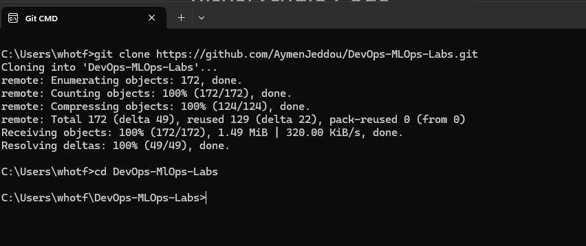
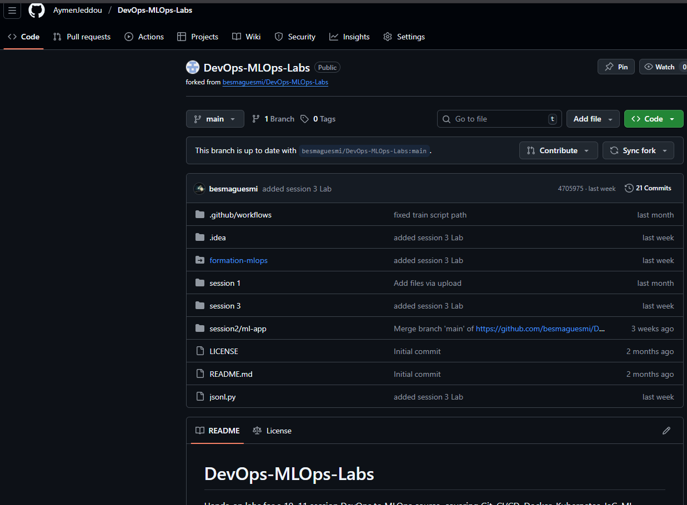
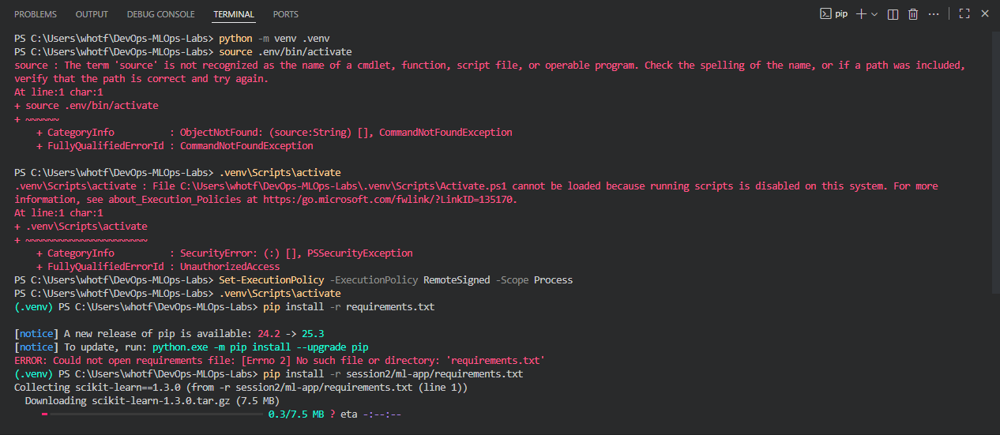
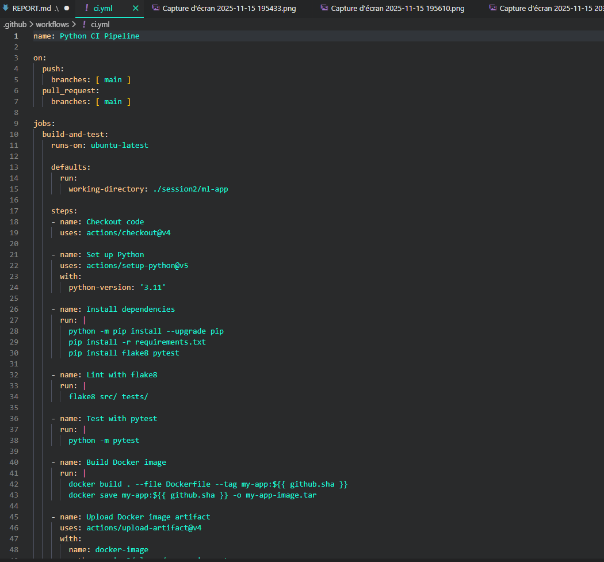

# CI/CD Pipeline Implementation Report

**Student:** Aymen Jeddou
**Project:** ML Application DevOps Pipeline
**Date:** November 16, 2025

***

## Overview

This project centers on automating an end-to-end machine learning workflow, combining code quality control and reliable delivery using Docker and GitHub Actions. The process covers local app setup, testing, code style enforcement, containerization, and continuous integration.

***

## Task 1: Repository Initialization

I began by cloning the repository for this machine learning project: `DevOps-MLOps-Labs`. The structure was validated to ensure all essential files including a `requirements.txt` were present for Python environment setup.

**Key dependencies:**

- ML libraries: scikit-learn, pandas, numpy
- Dev tools: pytest, flake8
- Visualization/storage: matplotlib, seaborn, joblib

**Screenshots:**




## Task 2: Local Project Setup \& Execution

**Development steps:**

1. Created a local Python environment using:

```
python -m venv .venv
```

2. Activated and installed required packages:

```
.venv\Scripts\activate( the command you provided only works on linux)
pip install -r session2/ml-app/requirements.txt (when i ran pip install -r requirements.txt it didn't work so i specified the path)
```


3. Ran the training script:

```
python src/train.py
```

    - The model was successfully trained and the output artifacts saved in the `models/` directory.

**Screenshot:**


***

## Task 3: Unit Test Creation

Using Pytest, I tested the app via the test functions already available in tests folder

**Execution:**

```powershell
python -m pytest
```


All six tests executed and passed, confirming robustness of the core components.

**Screenshot:**

***

## Task 4: Code Linting \& Formatting

To enforce code quality, i used flake8 to test my code if it has any problems

**Process:**

1. Install and configure flake8( already installed in requirement.txt)
2. flake8 src/ tests/

**Screenshot:**

***

## Task 5: Continuous Integration Workflow

A CI pipeline was set up using GitHub Actions (`.github/workflows/ci.yml`) to automate the following on every push or PR:

- Code checkout
- Python environment setup
- Dependency installation
- Lint and unit test execution
- Docker image build
- Artifact uploads (test results, Docker images)

The workflow reliably executes on every code update, maintaining high code standards and reproducible builds.

**Screenshots:**





***

## Task 6: Docker Containerization

A Dockerfile was added describing the environment, dependencies, and startup command (`python src/train.py`). Builds were tested both locally and, due to engine issues, validated in the CI pipeline.

**Highlights:**

- Container executes ML training and saves artifacts on run
- Docker image builds and runs as expected

**Screenshots:**

- Building and running the image


## Usage Instructions

**Setup and train locally:**

```bash
git clone https://github.com/AymenJeddou/DevOps-MLOps-Labs.git
cd DevOps-MLOps-Labs
python -m venv .venv
.venv\Scripts\activate
pip install -r requirements.txt
python src/train.py
```

**Run tests:**

```bash
pytest tests/
```

**CI/CD:**
Automated pipeline validates code and artifacts on every commit or PR.

***

## Conclusion

This pipeline demonstrates a full DevOps ML workflow, ensuring:

- Reliable automated testing
- Consistent code quality control
- Containerized ML workloads
- Seamless deployment with CI/CD

***

## Repository

- [Project Repository](https://github.com/AymenJeddou/DevOps-MLOps-Labs)

***